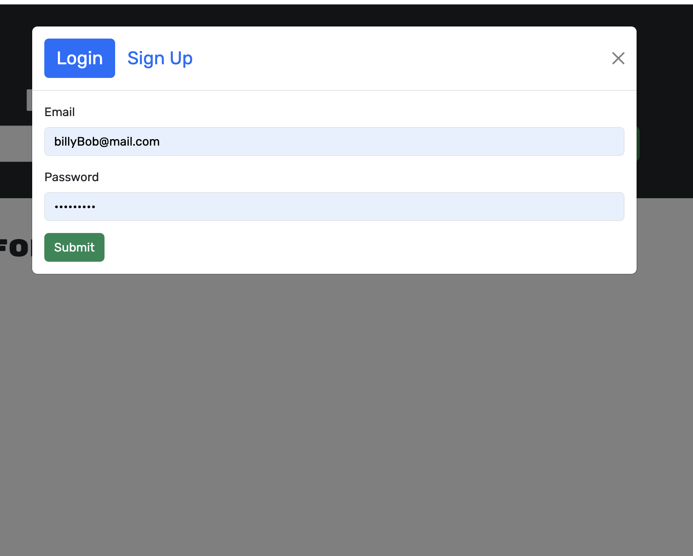

# Book-search-engine

---

## Badges

---

## Table of Contents

---

- [Description](#description)
- [Images](#images)
- [Installation](#installation)
- [Credits](#credits)
- [Questions](#questions)
- [Links](#links)

## Description

---

This application is a book search engine that uses the google books API to allow the user to search their database for books. You can login to the app and save books that you may want to revisit, as well as delete them from your list. There are links to nav links to login/signup, search for books, and view your saved books. I was given a fully fuctioning app built with MERN stack and a RESTful API and refactored it to be a GraphQL API built with the Apollo Server.

## Images

---

## Installation

---

You can fork the repo and load it on your local machine and run `npm i` to install the node dependencies, then run `npm run develop` to start the servers. Navigate to `localhost:3001` to start the fun.

## Credits

---

This application was built with the help of Rice universities Full stack web developement bootcamp.

## Links

---

## Contact Information

---

### Github: [Phillip Pfister](https://github.com/Phil-Pfister)

### Email: salshouse@gmail.com

## License

---

This application uses the The Unlicense license
